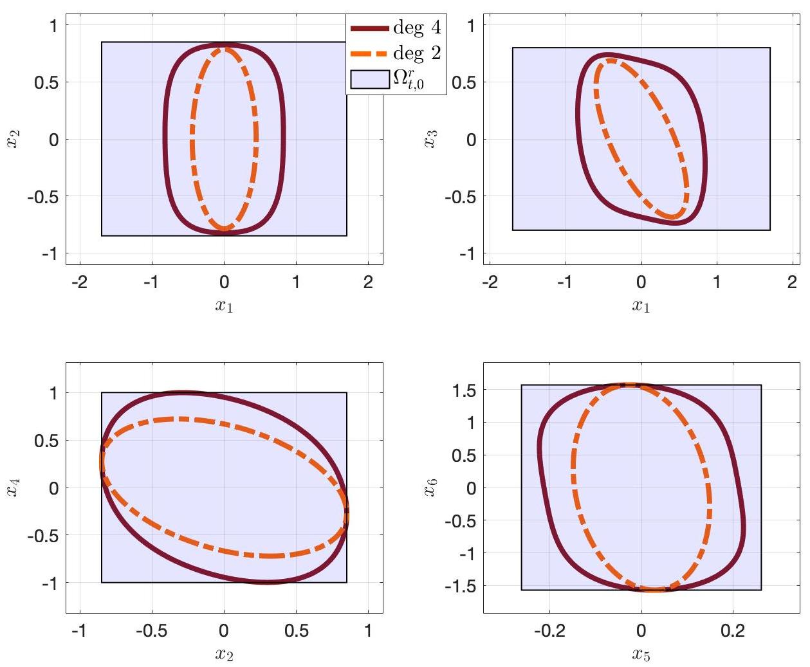

# Backward-Reachability-Analysis-and-Control-Synthesis
This code is to accompany the paper: [Backward reachability for polynomial systems on a finite horizon](https://arxiv.org/pdf/1907.03225.pdf). It computes inner-approximations to the backward reachable set, and the accompanying control law.

### Authors:
He Yin (he_yin at berkeley.edu)

## Getting Started
All the code is written in MATLAB.

### Prerequisites
There are four packages required:
* [MOSEK](https://www.mosek.com/): Commercial semidefinite programming solver
* [SOSOPT](https://dept.aem.umn.edu/~AerospaceControl/): General SOS optimization utility
* [Multipoly](https://dept.aem.umn.edu/~AerospaceControl/): Package used to represent multivariate polynomials
* [Sedumi](https://github.com/sqlp/sedumi): Free semidefinite programming solver

## Way of Using the Code
Go to each example folder, and run the file **Application.m**

## BRS inner-approximations for a 6-state quadrotor
